# Project 1: On-Board Diagnostic II (OBD-II) Code Reader with Data Logging

This repository contains the work for our Project 1 at HCMUTE, focusing on the design and implementation of a standalone OBD-II scanner. This device can read diagnostic data from a vehicle's ECU and features real-time data logging capabilities. 

## 📝 Description

Modern vehicle diagnostic systems are increasingly complex, with OBD-II becoming a critical standard for monitoring and diagnosing engine issues. However, existing diagnostic tools on the market are often either too expensive (professional-grade) or too limited (consumer-grade).

The common limitations of affordable devices include:
* Requiring a smartphone and an app to function. 
* Only displaying fault codes without offering suggestions for repair. 
* Lacking real-time data logging functionality. 

This project aims to create a low-cost, standalone device that overcomes these limitations. It is designed to provide essential diagnostic functions, offer repair guidance, and log data for predictive maintenance, all at a more accessible price point. 

## ✨ Key Features

The device implements two main categories of functions:

### Basic Functions
* **ECU Communication:** Connects and communicates with the vehicle's ECU via the OBD-II port.
* **Live Data Reading:** Reads real-time engine sensor data (e.g., RPM, coolant temperature, vehicle speed, airflow).
* **DTC Management:** Reads, decodes, and clears Diagnostic Trouble Codes (DTCs), turning off the "Check Engine" light.
* **Vehicle Info:** Retrieves vehicle information such as VIN and Fuel System Status.

### Enhanced Functions
* **Repair Suggestions:** Provides potential troubleshooting steps based on the detected fault code and its severity.
* **Data Logging:** Logs all read data in real-time to an SD card, which can be used for future analysis or predictive maintenance.
* **Standalone Operation:** Features an integrated display and navigation buttons, allowing it to function without any phone or PC.

## 🛠️ Tech Stack & Specifications

* **Microcontroller:** STM32F103xx
* **OBD-II Interface:** CAN controller + CAN transceiver
* **Supported Protocol:** CAN (ISO 15765-4)
* **User Interface:** ST7735 1.44" LCD and push-buttons 
* **Storage:** SD Card
* **Power:** Powered directly from the vehicle's OBD-II port

## 🔌 Design and Implementation

### **1. Block Diagram**

### **2. Schematics:**

### **3. Flow Chart:**

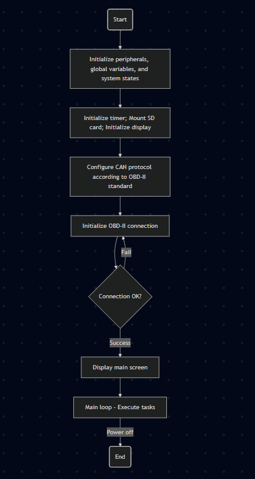

### **4. Device:**
**Top-side**
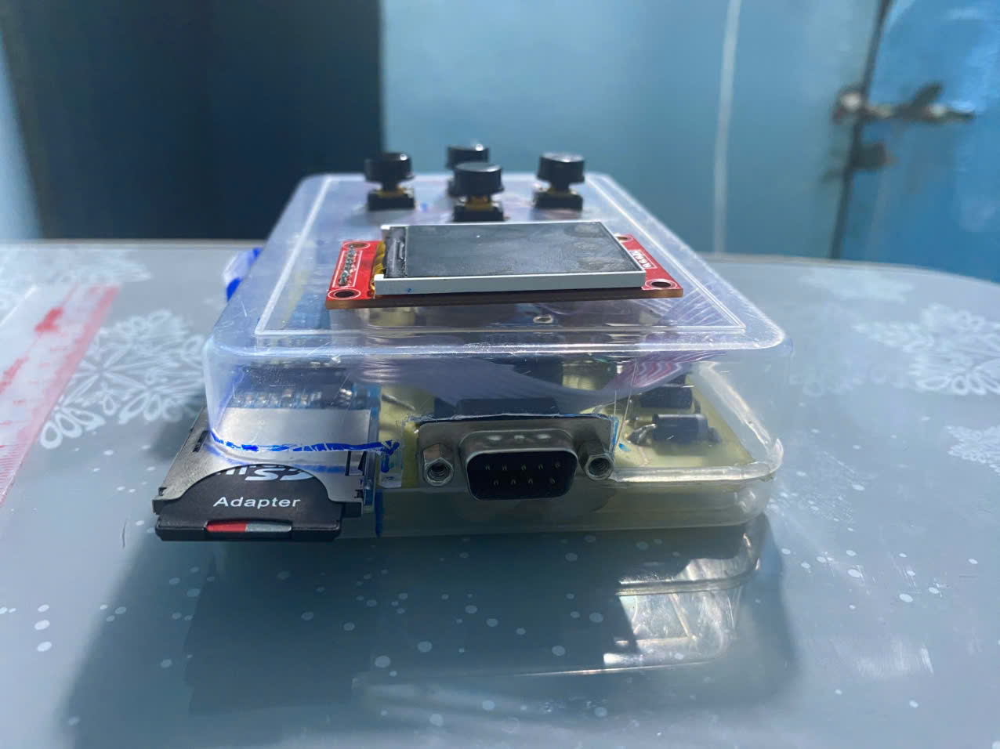

**Board-side**
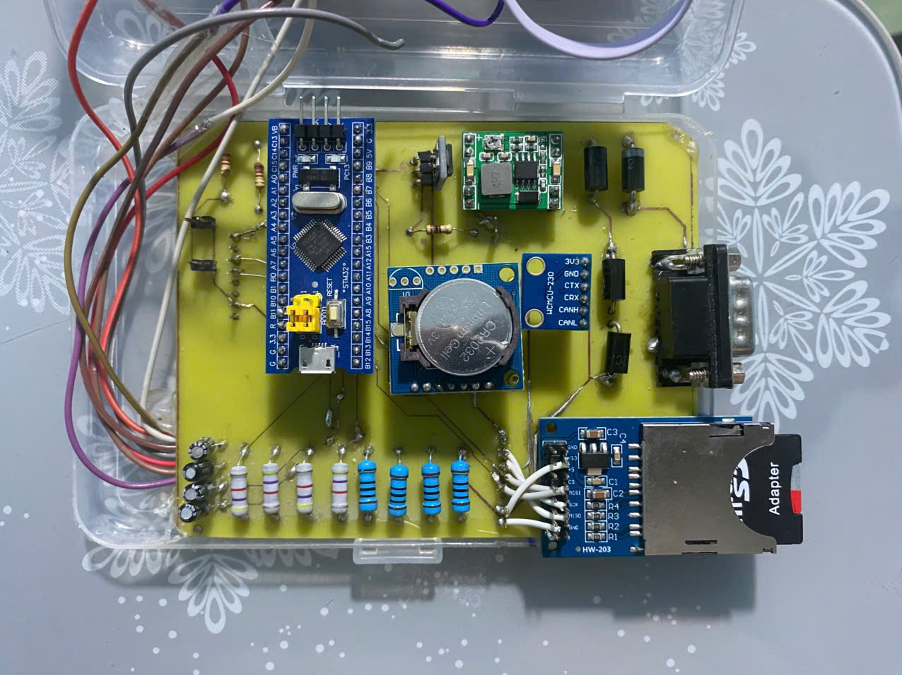

**Front-side**
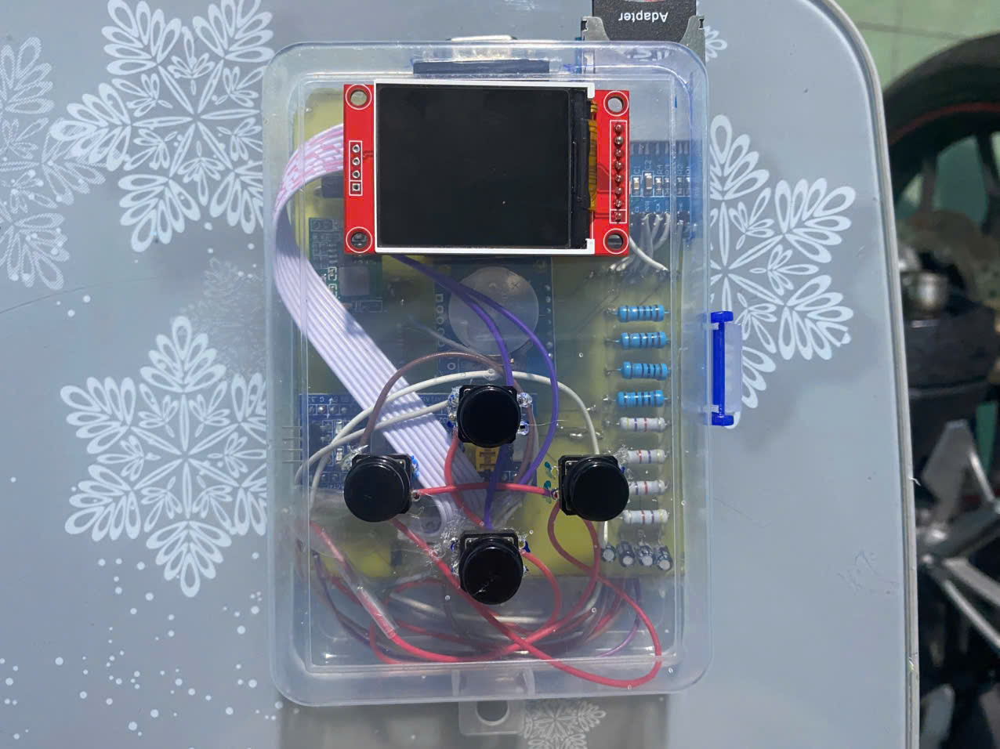
### **5. Operation:** 

**Main menu after start the device and connect to the OBD-II target**
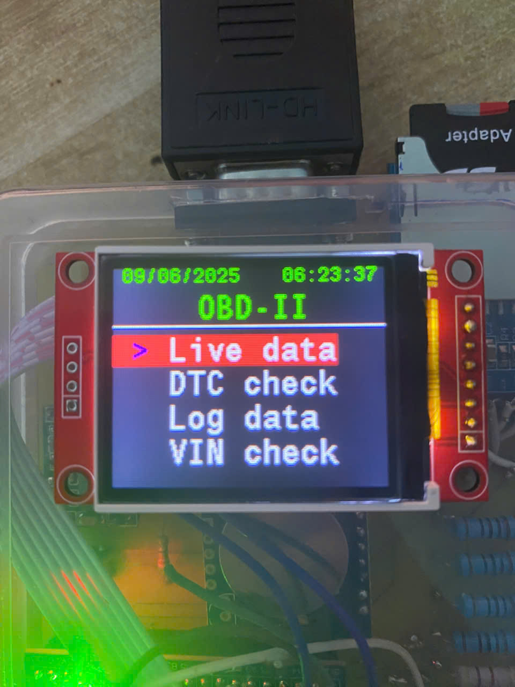

**Live Data feature**
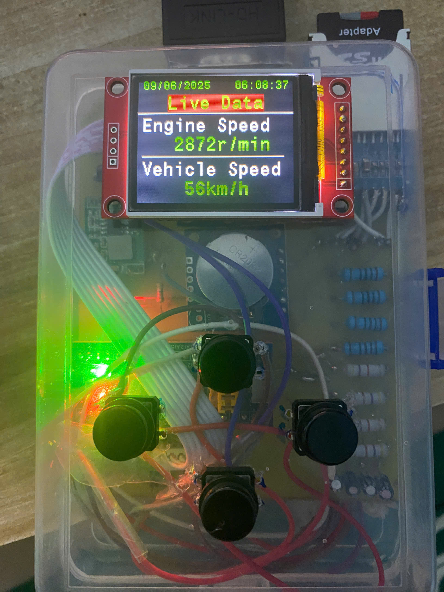
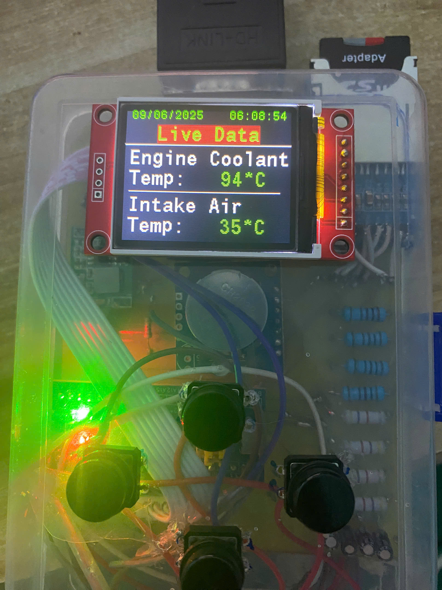
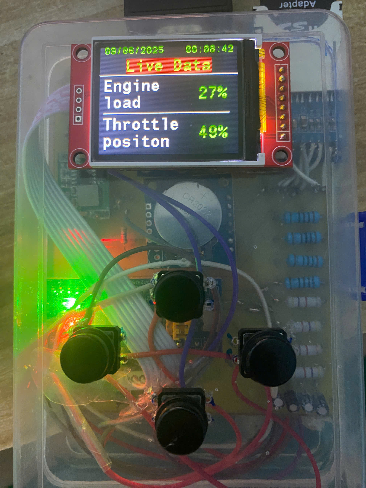
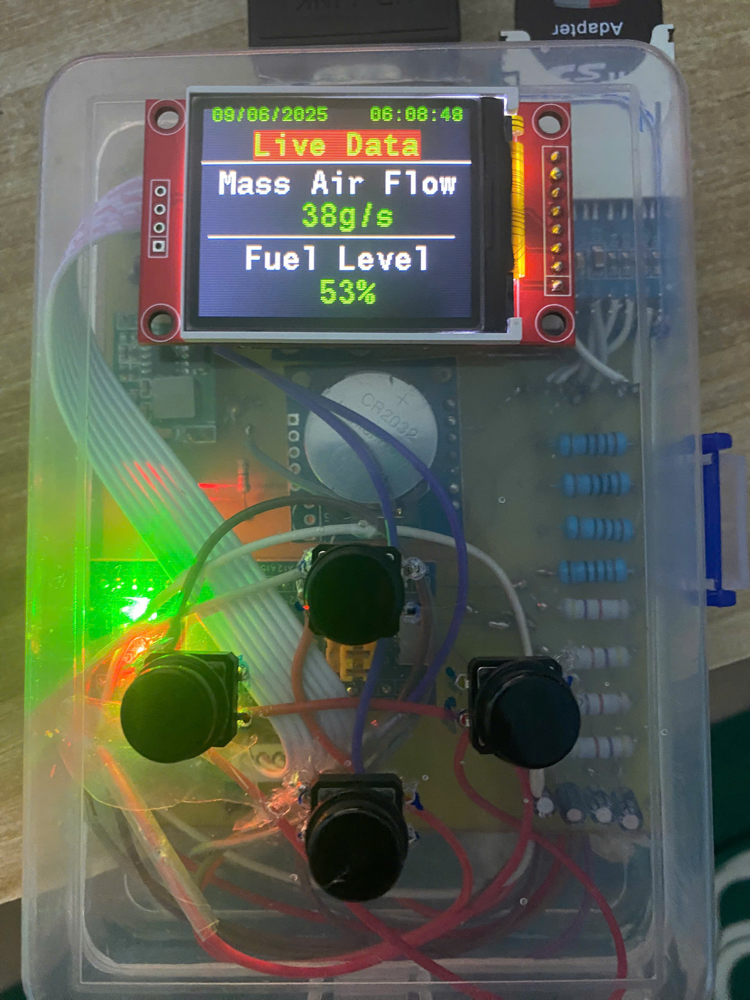

**DTC checking feature**
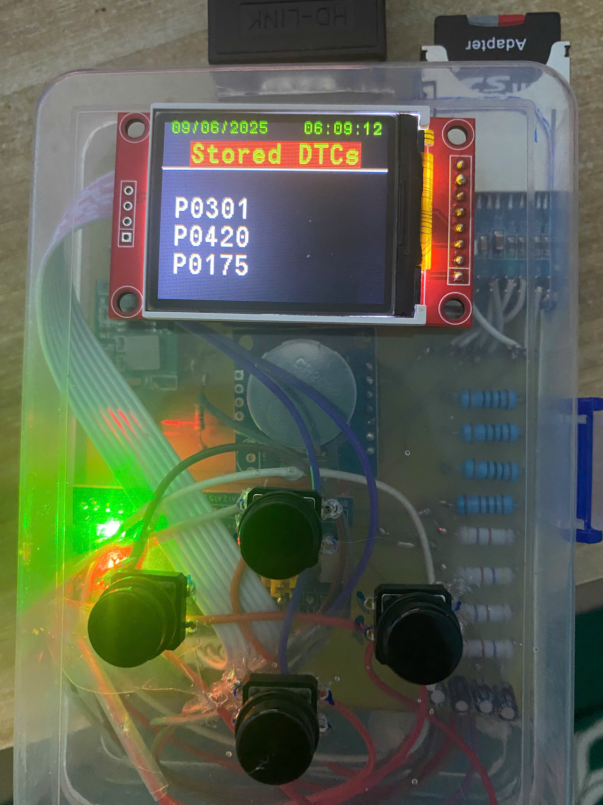

**VIN checking feature**
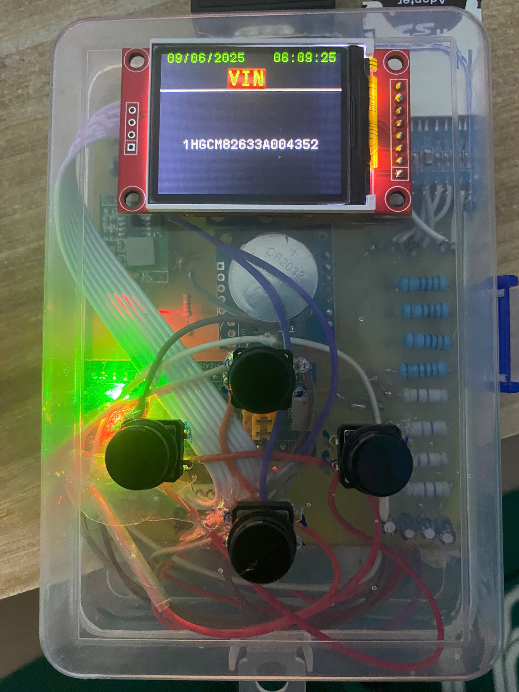

**Data logging feature**
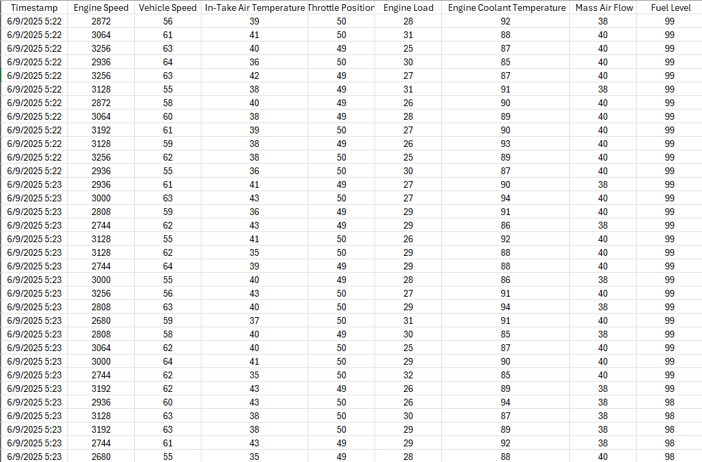
## 👨‍💻 Authors

* **Lê Huỳnh Đức and Nguyễn Văn Xuân Thành**
@HCMUTE - 2025
